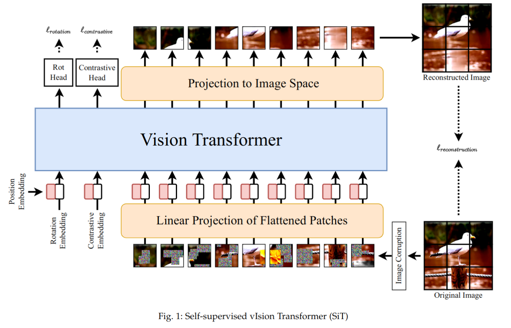

# SiT: Self-supervised vIsion Transformer 



This repository contains the official PyTorch self-supervised pretraining, finetuning, and evaluation codes for SiT (Self-supervised image Transformer).

The finetuning strategy is adopted from [Deit](https://github.com/facebookresearch/deit) 

# Usage
- Create an environment
> conda create -n SiT python=3.8
- Activate the environment and install the necessary packages
> conda activate SiT

> conda install pytorch torchvision torchaudio cudatoolkit=11.0 -c pytorch

> pip install -r requirements.txt


# Self-supervised pre-training
> python -m torch.distributed.launch --nproc_per_node=4 --use_env main.py --batch_size 64 --epochs 801 --data-set 'ImageNet' --output_dir 'checkpoints/SSL/ImageNet'

Self-supervised pre-trained models using SiT can be downloaded from [here](https://drive.google.com/drive/folders/1b1Yu1r-yaflz8Uu_D9oE6ft5TMwK-wLR?usp=sharing)

**Notes:** 
1. assign the --dataset_location parameter to the location of the downloaded dataset
2. Set lmbda to high value when pretraining on small datasets, e.g. lmbda=5

If you use this code for a paper, please cite:

```
@article{atito2021sit,

  title={SiT: Self-supervised vIsion Transformer},

  author={Atito, Sara and Awais, Muhammad and Kittler, Josef},

  journal={arXiv preprint arXiv:2104.03602},

  year={2021}

}
```


# License
This repository is released under the GNU General Public License.


