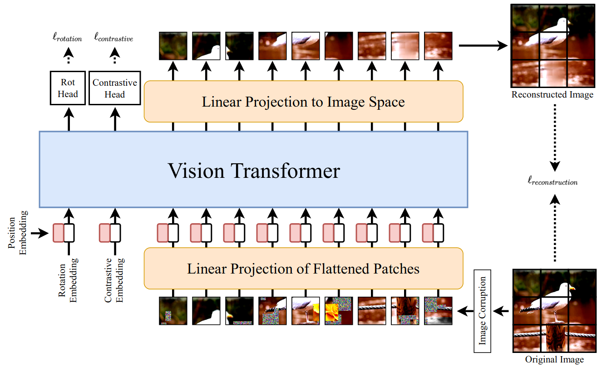

# SiT: Self-supervised vIsion Transformer 



This repository contains the official PyTorch self-supervised pretraining, finetuning, and evaluation codes for SiT (Self-supervised image Transformer).

The training strategy is adopted from [Deit](https://github.com/facebookresearch/deit) 

# Usage
- Create an environment
> conda create -n SiT python=3.8
- Activate the environment and install the necessary packages
> conda activate SiT

> conda install pytorch torchvision torchaudio cudatoolkit=11.0 -c pytorch

> pip install -r requirements.txt


# Self-supervised pre-training
> python -m torch.distributed.launch --nproc_per_node=4 --use_env main.py --batch-size 72 --epochs 501 --min-lr 5e-6 --lr 1e-3 --training-mode 'SSL' --data-set 'STL10' --output 'checkpoints/SSL/STL10' --validate-every 10 

# Finetuning
> python -m torch.distributed.launch --nproc_per_node=4 --use_env main.py  --batch-size 120 --epochs 501 --min-lr 5e-6 --training-mode 'finetune' --data-set 'STL10' --finetune 'checkpoints/SSL/STL10/checkpoint.pth' --output 'checkpoints/finetune/STL10' --validate-every 10 

# Linear Evaluation

**Linear projection Head**
> python -m torch.distributed.launch --nproc_per_node=4 --use_env main.py  --batch-size 120 --epochs 501 --lr 1e-3 --weight-decay 5e-4 --min-lr 5e-6 --training-mode 'finetune' --data-set 'STL10' --finetune 'checkpoints/SSL/STL10/checkpoint.pth' --output 'checkpoints/finetune/STL10_LE' --validate-every 10 --SiT_LinearEvaluation 1 

**2-layer MLP projection Head**
> python -m torch.distributed.launch --nproc_per_node=4 --use_env main.py  --batch-size 120 --epochs 501 --lr 1e-3 --weight-decay 5e-4 --min-lr 5e-6 --training-mode 'finetune' --data-set 'STL10' --finetune 'checkpoints/SSL/STL10/checkpoint.pth' --output 'checkpoints/finetune/STL10_LE_hidden' --validate-every 10 --SiT_LinearEvaluation 1 --representation-size 1024

**Note: assign the --dataset_location parameter to the location of the downloaded dataset**

If you use this code for a paper, please cite:

```
@article{atito2021sit,

  title={SiT: Self-supervised vIsion Transformer},

  author={Atito, Sara and Awais, Muhammad and Kittler, Josef},

  journal={arXiv preprint arXiv:2104.03602},

  year={2021}

}
```


# License
This repository is released under the GNU General Public License.


